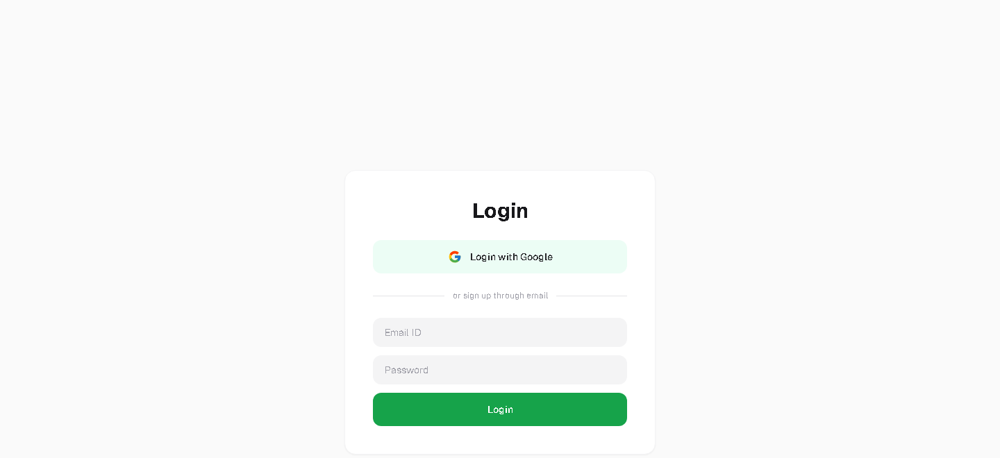
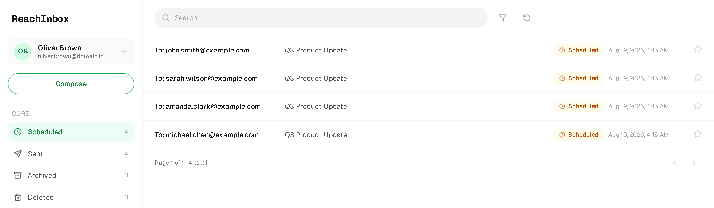
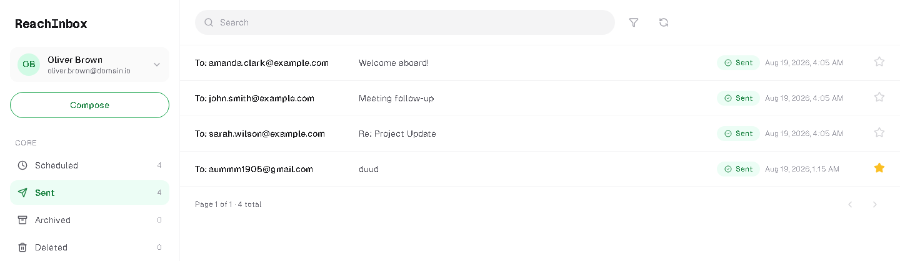
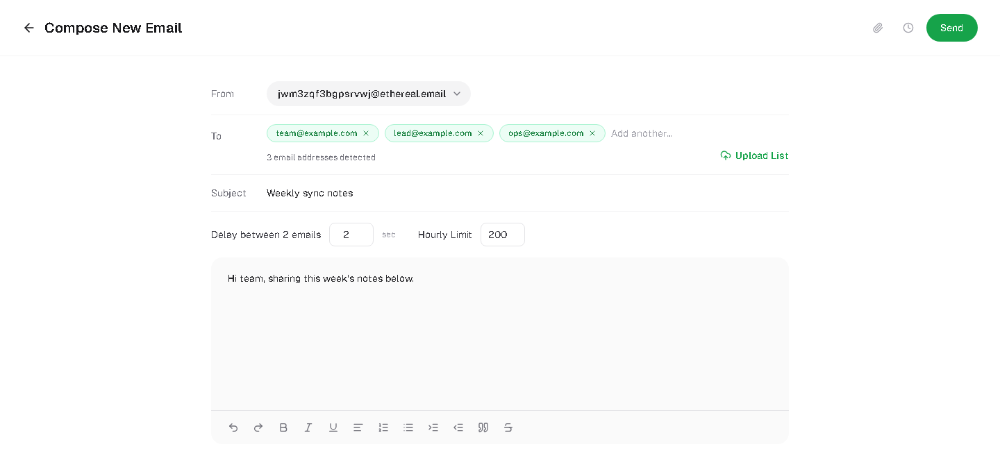
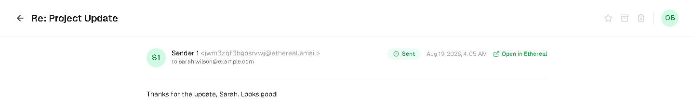
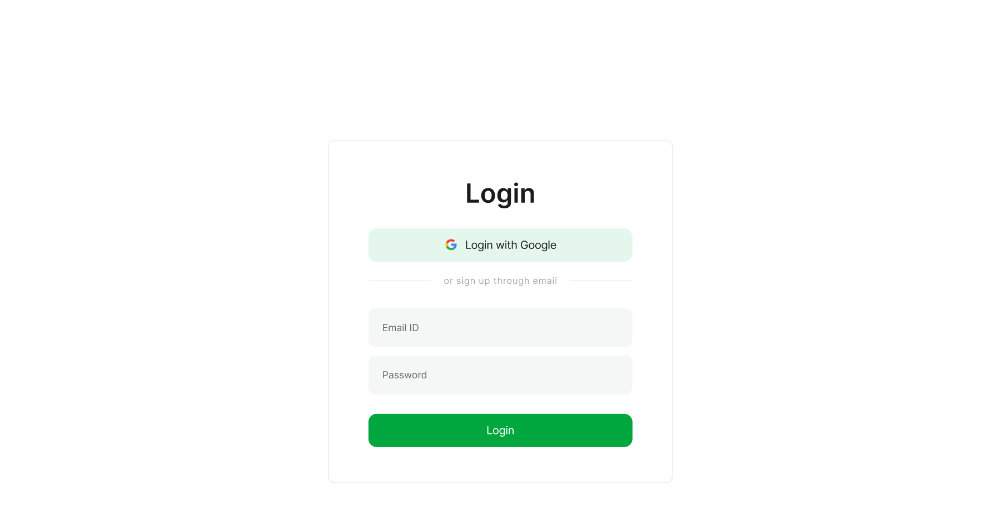
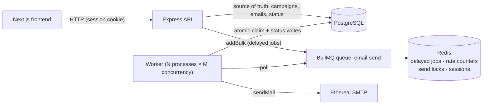

# ReachInbox

A full-stack email job scheduler: schedule campaigns to hundreds of recipients from a Next.js dashboard, and have a BullMQ-backed Node worker send them through Ethereal SMTP at the right time — surviving restarts, never double-sending, and respecting per-sender rate limits and minimum send gaps under concurrent load.

Built for the ReachInbox full-stack hiring assignment. This README is the single source of truth for what was built, how it works, and how to run it.

## Screenshots

| Login | Scheduled |
|---|---|
|  |  |

| Sent | Compose |
|---|---|
|  |  |

| Email detail |
|---|
|  |

### Figma fidelity

The Figma file's REST API export returned `403 File not exportable` (the design MCP couldn't pull tokens/frames directly), so the UI was matched by eye against exported reference screenshots instead — pixel-checked for layout, spacing, color, and typography. Those reference images are in [`design-refs/`](design-refs/); side by side with the app:

| Figma reference | Built |
|---|---|
|  |  |
|  |  |
|  |  |

Two things in the app go beyond the Figma frames: **Archived** and **Deleted** folders (with restore / permanently-delete), and real file **attachments** on compose — both added after the base UI was in place, using the same design tokens as everything else.

---

## Tech stack

| Layer | Choice |
|---|---|
| Backend runtime | Node 20+, TypeScript (strict), Express 4 |
| Queue | BullMQ v5 + ioredis |
| Database | PostgreSQL 16 + Prisma ORM |
| Mail | nodemailer + Ethereal (`createTestAccount`) |
| Auth | passport-google-oauth20 + express-session + connect-redis (sessions live in Redis) |
| Validation | zod |
| Logging | pino |
| Frontend | Next.js 14 (App Router) + TypeScript + Tailwind CSS |
| Data fetching | @tanstack/react-query + axios (`withCredentials`) |
| CSV parsing | papaparse (client-side) |
| Toasts | sonner |
| Icons | lucide-react |
| Tests | vitest (backend: rate limiter + recipient parsing) |
| Infra | Docker Compose: `postgres`, `redis` (AOF persistence enabled) |
| Bonus | Bull Board at `/admin/queues` (session-protected) |

The API server (`npm run dev`) and the worker (`npm run worker`) are **separate processes** sharing the same codebase and the same Postgres/Redis. That's deliberate — it's what proves the multi-instance safety claims below aren't just theoretical.

---

## Architecture



### How scheduling works (`POST /api/campaigns`)

1. Validate the request with zod: sender, subject (1–200 chars), body (1–50k chars), up to 10,000 recipients (deduped case-insensitively, invalid addresses dropped), `startAt` (must not be more than 60s in the past), `delayBetweenMs`, optional `hourlyLimit`, optional attachments.
2. `effectiveDelayMs = max(delayBetweenMs, MIN_DELAY_BETWEEN_EMAILS_MS)` — a campaign can ask for more spacing than the env default, never less.
3. In **one DB transaction**: insert the `Campaign` row, then insert one `Email` row per recipient with `scheduledAt = startAt + i × effectiveDelayMs`, `status = SCHEDULED`.
4. **After the transaction commits**, enqueue one BullMQ job per email — `jobId = "email-{id}"`, `delay = scheduledAt − now`. The job payload is just `{ emailId }`; the worker reads everything else from the DB, so edits stay consistent and jobs stay tiny.
5. Respond with `{ campaignId, scheduled, skippedInvalid, firstSendAt, lastSendAt }`.

DB-then-queue ordering matters: if the process dies between steps 3 and 4, the rows exist but have no job — boot reconciliation (below) notices and re-enqueues them. The reverse ordering (queue-then-DB) would risk a job existing for a row that was never actually committed.

### The worker (`src/worker/emailWorker.ts`)

For each job `{ emailId }`:

1. **Atomic claim** — `UPDATE emails SET status='PROCESSING', attempts=attempts+1 WHERE id=$1 AND status='SCHEDULED' RETURNING *`. If this affects 0 rows, another worker (or a stale retry) already handled it — log and return. This single query is the whole idempotency guarantee for concurrent workers.
2. **Hourly rate-limit check** (per sender, see below). If over the limit, defer the job to the next window and return without sending.
3. **Min-delay lock check** (per sender). If another send is still inside its cooldown window, defer by the remaining time.
4. **Send** via a cached nodemailer transporter for that sender.
5. **On success** — `status='SENT'`, `sentAt=now()`, `previewUrl` from `nodemailer.getTestMessageUrl()`.
6. **On failure** — if BullMQ attempts remain, revert to `SCHEDULED` and rethrow (BullMQ retries with exponential backoff, 3 attempts by default); on the final attempt, mark `FAILED` with `lastError`.

No module-level counters, no shared mutable state — every coordination point is a Postgres row or a Redis key, which is what makes running `WORKER_CONCURRENCY` threads inside `N` separate worker processes safe.

---

## Persistence on restart

Delayed jobs live in **Redis**, not in process memory, so killing and restarting the API or worker does not lose them — `docker-compose.yml` runs Redis with `--appendonly yes` so even a full Redis restart replays its AOF log and keeps the jobs.

**Boot reconciliation** (`src/queue/reconcile.ts`) runs once, synchronously, at the start of both `server.ts` and `workerMain.ts` — never on a timer:

1. For every `Email` with `status = SCHEDULED`, check whether its BullMQ job still exists (`queue.getJob(jobId)`). If not — e.g. Redis lost data — re-add it with `delay = max(0, scheduledAt − now)`.
2. For every `Email` stuck in `PROCESSING` for longer than `STALE_PROCESSING_MS` (default 5 minutes) — i.e. a worker crashed mid-send — reset it to `SCHEDULED` and re-enqueue.
3. Log the counts: `reconciled: X re-enqueued, Y stale reset`.

**Verified live, not just in theory:** during development I scheduled an email, killed both the API and worker mid-flight, confirmed nothing sent while they were down (no rogue cron), restarted, and watched it send once at its original time. Separately, I removed a job directly from BullMQ while its DB row still said `SCHEDULED` (simulating Redis losing that one job) and confirmed reconciliation logged `reEnqueued: 1` and the email still sent exactly once.

**Honest trade-off:** delivery is *at-least-once*, not exactly-once. There's a narrow window — SMTP accepts the message, then the process dies before the `SENT` write commits — where reconciliation would see a stale `PROCESSING` row and legitimately re-send. This is a known, accepted trade-off for this scope; closing it fully would need a durable outbox/idempotency-key pattern on the SMTP side, which Ethereal doesn't support anyway.

---

## Idempotency

Three independent layers, deliberately redundant:

1. **BullMQ jobId dedup** — `jobId = "email-{uuid}"` is unique per email row; BullMQ silently ignores `addBulk` calls for a jobId it already has.
2. **Atomic DB claim** — the `UPDATE ... WHERE status='SCHEDULED'` in the worker means only one caller can ever transition a row to `PROCESSING`, regardless of how many workers race for the same job.
3. **Unique constraint** — `@@unique([campaignId, toAddress])` in Postgres, plus client- and server-side dedup of the recipient list before insert.

**Verified live:** ran two worker processes against the same queue with 10 emails scheduled close together. Both workers picked up disjoint subsets of jobs (BullMQ's own delivery guarantee), zero duplicate sends, 10 unique Ethereal preview URLs, confirmed via `SELECT toAddress, count(*) ... GROUP BY 1 HAVING count(*) > 1` returning nothing.

---

## Rate limiting, delay & concurrency

| Control | Env var | Default | Scope |
|---|---|---|---|
| Worker concurrency | `WORKER_CONCURRENCY` | `5` | per worker **process** |
| Min gap between sends | `MIN_DELAY_BETWEEN_EMAILS_MS` | `2000` | per **sender** |
| Hourly send cap | `MAX_EMAILS_PER_HOUR_PER_SENDER` | `200` | per **sender**, per clock-hour window |

**Hourly limit** (`src/services/rateLimiter.ts`): `windowStart = floor(now / 3600s) × 3600s`, key `rl:sender:{senderId}:{windowStart}`, incremented atomically. If a send would exceed `min(campaign.hourlyLimit, env cap)`, the increment is reversed, an overflow slot in the *next* window is claimed (`rl:overflow:{senderId}:{nextWindow}`), and the email's `scheduledAt` is pushed to `nextWindow + overflowIdx × MIN_DELAY_BETWEEN_EMAILS_MS` — preserving send order and the minimum spacing guarantee even after deferral. The email's `status` stays `SCHEDULED`; a rate-limit deferral is never a failure.

*Why a custom counter instead of BullMQ's built-in limiter:* BullMQ's `limiter` option is per-queue, not per-sender — with multiple senders sharing one queue it would throttle everyone together. The custom Redis counter costs one extra round-trip per send but gives correct per-sender isolation.

**Min-delay lock** (`src/services/sendLock.ts`): `SET rl:lock:{senderId} 1 NX PX {MIN_DELAY_BETWEEN_EMAILS_MS}` before sending. If the lock is already held, the job is deferred by the remaining TTL. Because recipients are already staggered by `effectiveDelayMs` at enqueue time, this rarely fires in the normal path — it exists as a hard backstop under concurrency and after deferrals, where multiple jobs could otherwise become due at once.

**Worked example** — 1000 emails to one sender, `MIN_DELAY=2s`, `hourlyLimit=200`: enqueue staggers them 2s apart (≈33 minutes of sends). The first 200 land in window 1; 201–400 get pushed to window 2, 401–600 to window 3, and so on — order preserved via `sequenceIndex` → `overflowIdx`, nothing dropped, nothing marked `FAILED` for a rate-limit reason.

**Verified live under real concurrency:** with 2 worker processes and 10 emails at `delayBetweenMs=0`, several emails needed 2 claim attempts before sending (`attempts: 2` in the DB) — direct evidence the min-delay lock was actually contended and correctly deferred/retried, not just present in code. Also verified: 6 emails against `hourlyLimit=3` on a sender that already had 1 send that hour → exactly 2 sent, 4 correctly deferred to the next window, zero `FAILED`.

---

## Quick start

```bash
# 1. Infra
docker compose up -d postgres redis

# 2. Backend API
cd backend
cp .env.example .env      # then fill in GOOGLE_CLIENT_ID/SECRET, see below
npm install
npx prisma migrate dev
npm run seed               # creates 1-2 Ethereal senders
npm run dev                 # http://localhost:4000

# 3. Worker (second terminal)
cd backend
npm run worker

# 4. Frontend (third terminal)
cd frontend
cp .env.example .env.local
npm install
npm run dev                 # http://localhost:3000
```

`npm run dev:all` in `backend/` runs the API and worker together via `concurrently`, if you'd rather not manage two terminals.

### Google OAuth setup

1. [Google Cloud Console](https://console.cloud.google.com/apis/credentials) → create/select a project.
2. **OAuth consent screen**: User type = External, add your own Google account as a **test user** (the app stays in "Testing" mode, which is fine for local dev — anyone not added as a test user will see "access blocked").
3. **Create Credentials → OAuth client ID** → Application type: Web application.
4. Authorized JavaScript origin: `http://localhost:3000`
5. Authorized redirect URI: `http://localhost:4000/auth/google/callback`
6. Copy the Client ID and Secret into `backend/.env`.

### Ethereal (fake SMTP)

Senders are Ethereal test accounts, created automatically:
- On first boot, `npm run seed` creates up to `ETHEREAL_AUTO_CREATE_SENDERS` senders.
- From the app, Compose → "Create Ethereal sender" if none exist yet.
- Every sent email gets a `previewUrl` — click **Preview** in the table or **Open in Ethereal** in the detail view to see the actual rendered email in Ethereal's inbox viewer.

One thing worth knowing if you re-run the seed script: Ethereal pools test accounts per source IP for a while, so calling `createTestAccount()` twice in quick succession from the same machine can return the *same* account. The seed script catches the resulting unique-constraint error and skips gracefully rather than crashing — you may end up with 1 seeded sender instead of 2 on a given run, which is harmless.

---

## Environment variables

**`backend/.env`**

| Variable | Default | Purpose |
|---|---|---|
| `NODE_ENV` | `development` | |
| `PORT` | `4000` | API port |
| `FRONTEND_URL` | `http://localhost:3000` | CORS origin + OAuth redirect target |
| `DATABASE_URL` | — | Postgres connection string |
| `REDIS_URL` | `redis://localhost:6379` | Queue, sessions, rate limiter, locks |
| `SESSION_SECRET` | — | express-session signing secret |
| `GOOGLE_CLIENT_ID` / `GOOGLE_CLIENT_SECRET` | — | OAuth credentials |
| `GOOGLE_CALLBACK_URL` | `http://localhost:4000/auth/google/callback` | |
| `QUEUE_NAME` | `email-send` | BullMQ queue name |
| `WORKER_CONCURRENCY` | `5` | Jobs processed in parallel per worker process |
| `MIN_DELAY_BETWEEN_EMAILS_MS` | `2000` | Minimum gap between sends, per sender |
| `MAX_EMAILS_PER_HOUR_PER_SENDER` | `200` | Hard cap, per sender per clock-hour |
| `STALE_PROCESSING_MS` | `300000` | How long a stuck `PROCESSING` row waits before reconciliation resets it |
| `JOB_ATTEMPTS` | `3` | BullMQ retry attempts before `FAILED` |
| `ETHEREAL_AUTO_CREATE_SENDERS` | `2` | Senders created by `npm run seed` |
| `LOG_LEVEL` | `info` | pino log level |

**`frontend/.env.local`**

| Variable | Default |
|---|---|
| `NEXT_PUBLIC_API_URL` | `http://localhost:4000` |

Both are loaded and validated with zod at startup (`src/config/env.ts`) — the process crashes fast with a clear message if anything required is missing, rather than failing confusingly later.

---

## API reference

Base URL `http://localhost:4000`. All `/api/*` routes except `/api/health` require an authenticated session (401 otherwise). Envelope: success `{ data }`, error `{ error: { code, message, details? } }`.

| Method | Path | Body / Query | Notes |
|---|---|---|---|
| GET | `/auth/google` | — | Redirects to Google |
| GET | `/auth/google/callback` | — | Redirects to `FRONTEND_URL/dashboard` or `/login?error=1` |
| GET | `/api/auth/me` | — | Current user or 401 |
| POST | `/api/auth/logout` | — | Clears session |
| GET | `/api/senders` | — | List senders (no `smtpPass`) |
| POST | `/api/senders/ethereal` | `{ name? }` | Creates + stores a new Ethereal sender |
| POST | `/api/campaigns` | `{ senderId, subject, body, recipients[], startAt, delayBetweenMs, hourlyLimit?, attachments? }` | Schedules a campaign |
| GET | `/api/campaigns` | `?page&limit` | Paginated campaign list |
| GET | `/api/emails` | `?status=scheduled\|sent\|archived\|deleted&page&limit&search&sortBy=date\|subject\|recipient&sortDir=asc\|desc` | Folder-scoped, searchable, sortable |
| GET | `/api/emails/:id` | — | Full email incl. body, attachments, `previewUrl`, `lastError` |
| PATCH | `/api/emails/:id/star` | `{ starred }` | Toggle favorite |
| PATCH | `/api/emails/:id/archive` | `{ archived }` | Archive / unarchive |
| PATCH | `/api/emails/:id/trash` | `{ deleted }` | Move to Trash / restore — also cancels any pending send job |
| DELETE | `/api/emails/:id` | — | **Permanent** delete (only meaningful from Trash) |
| GET | `/api/health` | — | `{ ok, db, redis, queue: { waiting, delayed, active, completed, failed } }` |
| * | `/admin/queues` | — | Bull Board UI (session-protected) |

---

## Frontend

- **`/login`** — "Login with Google" (real OAuth); already-authenticated users are redirected to `/dashboard`.
- **`/dashboard`** — protected by `AuthGuard`, which distinguishes *unauthenticated* (401 → redirect to login) from *server unreachable* (any other error → inline retry, not a bogus logout).
- Four folders in the sidebar with live counts: **Scheduled**, **Sent**, **Archived**, **Deleted** — all four poll every 5s so rows visibly move between them during a demo.
- **Compose**: sender picker (or create an Ethereal sender inline), recipient chips with a `+N` overflow, CSV/text upload via drag-and-drop (detected/invalid counts shown), a lightweight rich-text body, delay/hourly-limit inputs, a "Send Later" popover, and file attachments (5 files / 6MB each / 11MB combined, enforced client- and server-side).
- **Email detail view** — click any row to see the full email in-app (not just an external link): sender, recipient, body, status, and downloadable attachments, with actions that adapt to context (Star/Archive/Trash normally; Restore/Delete-forever while viewing something already in Trash).
- **Tables**: search, sort (date/subject/recipient, either direction), pagination, skeleton loading state, empty state per folder, and an error state with Retry that's distinct from being logged out.

---

## Testing

### Automated

```bash
cd backend
npm test
```

- `tests/rateLimiter.test.ts` — admits exactly `limit` sends in a window, defers the `limit+1`th to the next window, and confirms concurrent callers never exceed the limit.
- `tests/recipients.test.ts` — dedup, invalid-row skipping, and count correctness for the CSV/text parser.

### Manual acceptance (all verified during development, not just written)

1. Login with Google → dashboard shows name/email/avatar; refresh keeps the session; logout actually clears it (not just client-side routing).
2. Compose with several recipients, short delay → Scheduled tab shows staggered `scheduledAt` times.
3. Wait → rows move to Sent with correct times; Preview opens the real Ethereal message.
4. **Restart test**: schedule ahead, kill API + worker, wait, restart — email sends once, at its original time, `reconciled` logged.
5. **Redis job loss test**: remove a job directly from BullMQ while its row is still `SCHEDULED`, restart — reconciliation logs `reEnqueued: 1`, email still sends exactly once.
6. **Rate limit test**: low `hourlyLimit`, over-limit batch — some send, the rest defer to the next window, none `FAILED`.
7. **Two workers**: run `npm run worker` twice, schedule a batch — zero duplicate sends, verified against the DB directly.
8. Empty states, loading skeletons, and an API-down error+retry state all render correctly (not a blank crash).
9. `grep -ril cron backend/src` returns exactly one hit — a comment in `reconcile.ts` explicitly documenting that it is *not* a cron. `grep -rn setInterval backend/src` returns nothing.

---

## Deployment

**Frontend → [Vercel](https://vercel.com)**, zero-config for Next.js.

**Backend (API + worker) + Postgres + Redis → [Render](https://render.com)**, via the `render.yaml` Blueprint at the repo root — it defines the web service, database, and Redis instance in one file, so most of the setup is "New Blueprint → pick this repo" rather than manually configuring each piece.

A deliberate adaptation for the free tier: Render's free plan doesn't offer a Background Worker service type at all, and free Web Services spin down after 15 minutes with no HTTP traffic. Rather than pay for a separate worker service, the API and worker are started as two child processes of one Render Web Service (`npm run start:combined`, via `concurrently`) — locally they're still two independent processes (`npm run dev` / `npm run worker`) exactly as described throughout this README; this is a deploy-time packaging choice, not an architecture change. To keep that one service from sleeping (which would pause the worker too), a free external uptime monitor (e.g. UptimeRobot) pings `/api/health` every 5 minutes — comfortably under the 15-minute idle timeout. If a sleep/restart ever does slip through anyway, boot reconciliation (already covered above) catches up anything that should have sent.

Steps:
1. Push to GitHub (already done).
2. Render dashboard → **New → Blueprint** → select this repo. Render provisions the web service, Postgres, and Redis from `render.yaml`.
3. Fill in the prompted secrets: `GOOGLE_CLIENT_ID`, `GOOGLE_CLIENT_SECRET`, `FRONTEND_URL` (your Vercel URL, once you have it).
4. Once deployed, note the service's `onrender.com` URL and update `GOOGLE_CALLBACK_URL` in Render's env vars if it differs from the default in `render.yaml`.
5. Add that same callback URL to **Authorized redirect URIs** in Google Cloud Console.
6. Deploy `frontend/` to Vercel, setting `NEXT_PUBLIC_API_URL` to the Render URL.
7. Set up the free UptimeRobot monitor against `https://<your-render-url>/api/health`, 5-minute interval.

Because the frontend and backend are on different domains in this setup, the session cookie is sent cross-site — `backend/src/auth/session.ts` sets `sameSite: "none"` (only in production; `"lax"` locally) together with `secure: true`, and `app.ts` sets `app.set("trust proxy", 1)` so Express correctly recognizes the request as HTTPS behind Render's proxy.

---

## Assumptions & trade-offs

- Rate limiting is **per-sender**, not global — the assignment allows either; per-sender was chosen because it maps directly onto real SMTP throttling behavior. A campaign's `hourlyLimit` can't exceed the env-wide cap.
- Delivery is **at-least-once** (see the Persistence section above) — a narrow crash window between SMTP-accept and the DB write could in theory produce one duplicate. Accepted trade-off for this scope.
- Times are stored in UTC, displayed in the browser's local timezone.
- Recipients are deduplicated per campaign; the same address across two different campaigns is allowed (they're independent sends).
- Email body is sent as HTML with an auto-generated plain-text fallback (tags stripped).
- No cron anywhere — the only time-based mechanism is BullMQ delayed jobs; reconciliation runs once at process boot, never on a timer.
- Ethereal accounts are auto-created and stored server-side; credentials never reach the client (`smtpPass` is stripped from every API response).
- Retry policy: 3 attempts with exponential backoff (5s base); failures beyond that are marked `FAILED` and stay visible in Sent.
- **Archived / Deleted folders and file attachments** are not in the original assignment brief — they were added afterward as real, fully wired features (not mockups), using the same backend patterns (Prisma migrations, zod-validated routes, react-query hooks) as everything else.
- Attachments are stored on the **Campaign** row (base64, capped at 11MB combined) rather than duplicated per recipient — correct for this scope, but would need object storage (S3-style) instead of a Postgres `Json` column for very large campaigns or larger files.
- Render's free Postgres is deleted after 30 days (Render's own free-tier policy, not something this app controls) — fine for grading, not for a real deployment. Render's free Redis also has a small memory cap; BullMQ needs `maxmemory-policy: noeviction` (set in `render.yaml`) so Redis refuses new writes under pressure instead of silently evicting job data, rather than the default eviction behavior quietly dropping scheduled jobs.

---

## Demo video

_TODO: add the ≤5 minute walkthrough link here (login → compose → restart survival → rate limiting → empty/error states)._
